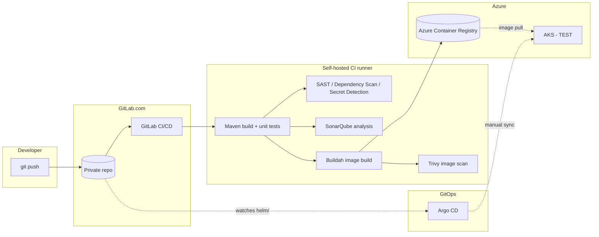

# GitLab DevSecOps Azure POC

A working, end-to-end DevSecOps pipeline for a Java microservices application: GitLab CI/CD with integrated security scanning, an immutable-artifact promotion model, Azure infrastructure managed entirely by Terraform, and GitOps deployment to Azure Kubernetes Service via Argo CD.

This repository holds the **infrastructure and pipeline artifacts** (Terraform, `.gitlab-ci.yml`, Helm chart, Argo CD manifest) produced while building the POC. The application itself is the public [spring-petclinic-microservices](https://github.com/spring-petclinic/spring-petclinic-microservices) project (Apache 2.0) — its own `docker/Dockerfile` already shipped a generic `ARTIFACT_NAME`/`EXPOSED_PORT` build-arg pattern, unmodified here; the one small change made to it was fixing two `FROM` image references from short names to fully-qualified registry references.

> **This is a proof-of-concept, not a production system.** See [`docs/production-readiness.md`](docs/production-readiness.md) for an explicit, honest breakdown of what's implemented, what's a deliberate POC simplification, and what a production deployment would still need. Real resource identifiers (registry hostnames, IPs, subscription/tenant IDs) have been redacted — see [`SECURITY-CHECKLIST.md`](SECURITY-CHECKLIST.md).

## Objective

Demonstrate a realistic CI/CD path for a multi-module Spring Boot application, with security scanning integrated at every pipeline stage — though not every scan is blocking yet in this POC (Trivy in particular runs with `allow_failure: true` and does not currently gate deployment; see [`docs/devsecops-controls.md`](docs/devsecops-controls.md)). One build produces one immutable, scanned artifact, deployed via GitOps rather than direct `kubectl apply` from CI. Promoting that same artifact, unrebuilt, across multiple environments (TEST → UAT → PROD) is the target design pattern — this POC has demonstrated it in a single TEST environment only; see "Demonstrated vs. not yet demonstrated" below.

## Architecture



**Key design decisions** (each with a written rationale in the corresponding Terraform/CI file):
- **Build once, scan once, promote the same immutable artifact** — images are tagged with the Git commit SHA, never `latest`.
- **No static registry credentials** — the CI host authenticates to ACR via its Azure Managed Identity (IMDS token exchange), and AKS's kubelet identity gets `AcrPull` via Terraform-managed RBAC, both without any long-lived secret.
- **GitOps, not push-based deployment** — Argo CD pulls desired state from Git; CI never runs `kubectl apply` against the cluster.
- **Layered, independent Terraform state** — bootstrap / CI host / registry / AKS are four separate state files sharing one backend, so a change to one layer can't corrupt another's state.
- **Security scanning is integrated, not bolted on** — SAST, dependency scanning, secret detection, and container image scanning all run as pipeline stages with the same visibility as build/test.

## Repository structure

```
.
├── terraform/              # 4 independent layers (see docs/architecture.md)
│   ├── bootstrap/           # remote-state storage (local state)
│   ├── main/                 # CI host, VNet/NSG
│   ├── acr/                  # container registry + RBAC
│   └── aks-test/             # AKS TEST cluster + RBAC
├── gitlab-ci/
│   └── .gitlab-ci.yml        # full pipeline: build → scan → image → deploy-ready
├── helm/spring-petclinic/    # generic, values-driven chart + Argo CD Application
├── docs/
│   ├── architecture.md
│   ├── cicd-pipeline.md
│   ├── devsecops-controls.md
│   └── production-readiness.md
└── SECURITY-CHECKLIST.md
```

## CI/CD flow

1. **Push** to the application repository triggers a GitLab pipeline (any branch, no path filtering).
2. **`build`** — Maven builds and unit-tests the full multi-module reactor.
3. **`test` stage, in parallel:**
   - SonarQube static analysis (Quality Gate failure blocks the pipeline).
   - GitLab-managed SAST, Dependency Scanning, and Secret Detection templates.
4. **`container-build`** — a matrix job builds and pushes all 8 service images to ACR via Buildah (rootless, no `privileged: true`), tagged with the immutable commit SHA. Authenticates via the CI host's Managed Identity — no static registry credential anywhere.
5. **`trivy-scan`** — scans each pushed image by its exact digest (not just its tag), non-blocking for this POC (findings are retained and visible, not gating).
6. **GitOps (designed workflow)** — a human (or a separately-approved automation) updates the Helm chart's `values.yaml` image tag and commits; Argo CD detects the resulting drift between Git and the live cluster. *This specific update → drift-detection loop is the designed workflow and has not yet been exercised end-to-end in this POC — see "Demonstrated vs. not yet demonstrated" below.*
7. **Manual sync (demonstrated)** — Argo CD is deliberately configured without `automated:` sync; the initial chart apply and a manually-triggered sync to a running TEST deployment have been demonstrated.

Full detail: [`docs/cicd-pipeline.md`](docs/cicd-pipeline.md).

## DevSecOps controls

| Stage | Tool | Blocking? |
|---|---|---|
| Static code analysis | SonarQube (Quality Gate) | Yes |
| SAST | GitLab-managed template | Depends on GitLab config |
| Dependency scanning | GitLab-managed template (SBOM-based) | Depends on GitLab config |
| Secret detection | GitLab-managed template | Depends on GitLab config |
| Container image scanning | Trivy, scanned by exact digest | No (POC choice — see [`docs/devsecops-controls.md`](docs/devsecops-controls.md)) |

## Azure infrastructure (Terraform)

Four independent layers, applied in order, each with its own state file in one shared backend:
1. **`bootstrap/`** — the remote-state storage account itself (necessarily local state — a backend can't depend on itself).
2. **`main/`** — the self-hosted CI runner host: VNet, NSG (SSH from one known IP only), a Linux VM with a system-assigned Managed Identity.
3. **`acr/`** — one shared Azure Container Registry (Basic SKU, admin account disabled), with a single `AcrPush` role assignment to the CI host's identity.
4. **`aks-test/`** — a single-node TEST AKS cluster (Free tier, kubenet networking), with a single `AcrPull` role assignment to its kubelet identity.

No NAT Gateway, Application Gateway, Bastion, or private endpoints anywhere — deliberately out of scope for this cost-conscious POC (see [`docs/production-readiness.md`](docs/production-readiness.md) for what a production network topology would add).

## Kubernetes / Helm / Argo CD

- **Helm chart** (`helm/spring-petclinic/`): one generic, values-driven chart — a single `Deployment`/`Service` template pair looped over a `services` map in `values.yaml`, not duplicated per service.
- **Scope is deliberately locked to 3 of the 8 upstream services** for this POC (`config-server`, `discovery-server`, `vets-service`) — enough to prove the full dependency chain (centralized config → service discovery → a real business service) without the compute cost of running all 8 on a single small test node.
- **Argo CD**, installed non-HA (SSO/notifications/ApplicationSet controllers scaled to zero — not needed for a single-app POC), configured for **manual sync only**.
- **Resource requests/limits** are sized against the TEST node's actual measured allocatable capacity, not guessed — see [`docs/production-readiness.md`](docs/production-readiness.md).

## Demonstrated vs. not yet demonstrated

**Demonstrated, with real verification evidence** (see [`docs/production-readiness.md`](docs/production-readiness.md) for the exact evidence — application logs, live registry/API queries, `kubectl` output, not just "pods say Running"):
- GitLab CI → ACR — all 8 service images built, pushed, and Trivy-scanned in a real pipeline run.
- Helm chart → Argo CD → AKS TEST — a real 3-service deployment, with Eureka service registration and centralized-configuration serving confirmed via live queries against the running services, not inferred from pod status alone.

**Not yet demonstrated:**
- Automated image-tag promotion — today, updating `values.yaml`'s image tag to a new commit's images is a manual edit and commit; no promotion job or tool exists yet.
- UAT/PROD promotion of the same artifact — this POC has only ever reached a single TEST environment.

## Getting started (adapting this to your own subscription)

This repository is a reference, not a one-command deploy — every placeholder below needs a real value from **your own** Azure subscription and GitLab project:

1. `terraform/bootstrap/` → `terraform init && terraform plan` → review → `apply` (creates remote-state storage only).
2. `terraform/main/` → copy `terraform.tfvars.example` → fill in your own SSH public key and source IP → `apply` (CI host).
3. Install GitLab Runner, Docker/Buildah, JDK, and (optionally) SonarQube on the CI host yourself — not Terraform-managed in this POC.
4. `terraform/acr/` → `apply` (registry).
5. `terraform/aks-test/` → `apply` (TEST cluster).
6. Copy `gitlab-ci/.gitlab-ci.yml` into your application repo, replace the `<your-acr-name>.azurecr.io` placeholders with your real ACR login server.
7. Install Argo CD (non-HA manifest, pinned version) into the cluster yourself.
8. Register a **read-only** repository credential (Deploy Key/Token) in Argo CD yourself — never generated or handled by any automation.
9. Apply `helm/spring-petclinic/argocd/application.yaml` (after replacing its `repoURL` placeholder) to register the Application, then trigger a manual Sync when ready.

## License

The original infrastructure and pipeline artifacts in this repository (Terraform, `.gitlab-ci.yml`, Helm chart, Argo CD manifests, documentation) are licensed under the [MIT License](LICENSE). The application this pipeline builds ([spring-petclinic-microservices](https://github.com/spring-petclinic/spring-petclinic-microservices)) is licensed separately, under Apache License 2.0, by its own authors, and is not included in this repository.
