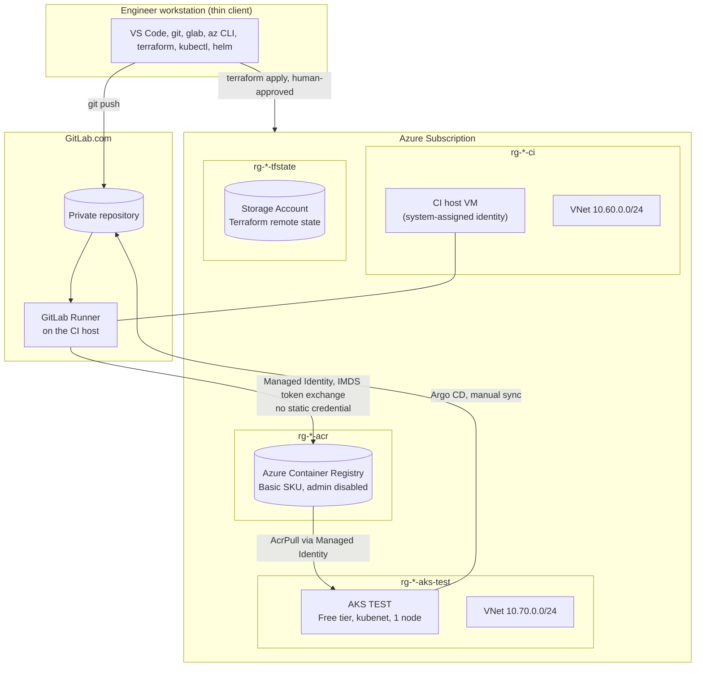

# Architecture

## Overview

## Why four separate Terraform layers

Each layer (`bootstrap`, `main`, `acr`, `aks-test`) has its own state file in one shared backend storage account, distinguished only by the blob `key`. This means:
- A mistake or `apply` in one layer cannot corrupt another layer's state.
- Layers can be torn down independently (e.g. delete the TEST AKS layer without touching the CI host or registry).
- Cross-layer references (e.g. the AKS kubelet identity needing the ACR's resource ID) go through `terraform_remote_state` data sources — read-only, one layer can never write into another's state.

`bootstrap/` is the one necessary exception: it creates the remote-state storage itself, so it cannot use a remote backend for its own state (a backend can't depend on the resource it's storing state for). Its state stays local, applied once and rarely touched again.

## Why a self-hosted CI runner instead of GitLab's shared runners

A single small, disposable Azure VM hosts the GitLab Runner, Docker/Buildah, and (optionally) SonarQube — kept off the engineer's own workstation, which stays a thin client. This also enables Managed-Identity-based Azure authentication for image pushes, which GitLab's shared SaaS runners cannot provide (they don't run inside your Azure subscription).

## Why Buildah instead of Docker-in-Docker

Building container images inside GitLab CI usually means either:
- **Docker-in-Docker**, which requires `privileged: true` on the runner — a meaningfully larger security surface, or
- **Kaniko**, a common alternative that avoids privilege but has its own tradeoffs.

This POC uses **Buildah** in rootless mode with the VFS storage driver, on a second, narrowly-scoped GitLab Runner whose Docker executor grants only the two Linux capabilities (`SYS_ADMIN`, `SYS_RESOURCE`) empirically required for rootless builds to work — not full `privileged: true`. The default runner used for `build`/`sonarqube` is left completely untouched.

## Why Managed Identity instead of a service principal or static ACR credentials

The CI host has a system-assigned Managed Identity. For image pushes, the pipeline exchanges an Azure AD token (from the Instance Metadata Service, `169.254.169.254`) for an ACR refresh token via ACR's own OAuth exchange endpoint — no client secret, no long-lived credential, nothing to rotate or leak. The same pattern (Managed Identity → RBAC role assignment, Terraform-managed) grants AKS's kubelet identity `AcrPull` with no static registry credential in the cluster either.

## Why kubenet instead of Azure CNI for AKS networking

Azure CNI allocates a real VNet IP address per pod, which requires sizing the subnet for the maximum expected pod count up front — unnecessary complexity and IP consumption for a single-node, 3-service TEST cluster. kubenet uses a separate internal overlay CIDR for pods, keeping the node subnet minimal (`/26`, 64 addresses) regardless of pod count.

## Why GitOps (Argo CD) instead of `kubectl apply` from CI

CI never has direct write access to the cluster. Instead, CI's only responsibility ends at "produce and scan an immutable artifact." A separate GitOps controller (Argo CD) running inside the cluster pulls desired state from Git and reconciles it — the cluster's credentials never leave the cluster, and every deployment has a Git commit as its audit trail. Sync is deliberately **manual** in this POC (see [`production-readiness.md`](production-readiness.md) for the automated-sync tradeoff at production scale).
