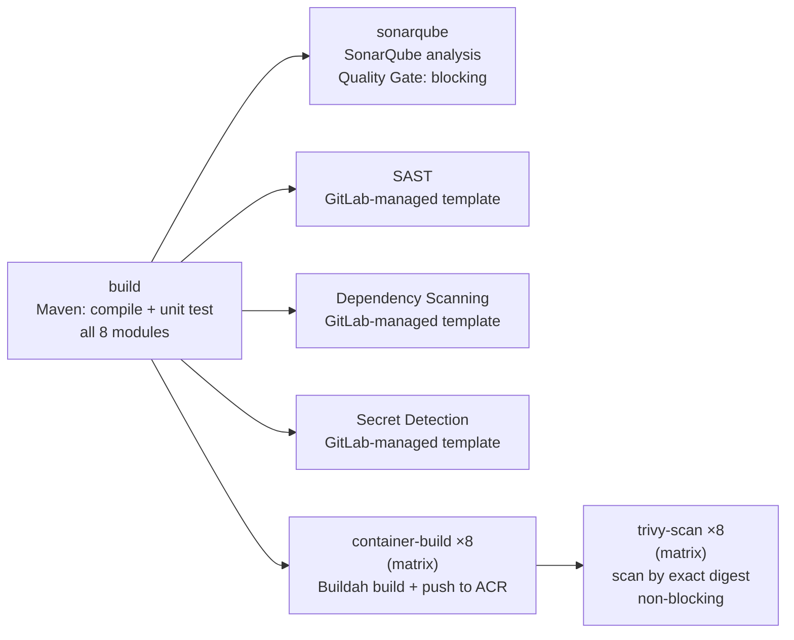

# CI/CD Pipeline

## Trigger

There is no `workflow:` or `rules:` restriction in `.gitlab-ci.yml` — GitLab's default applies: **any push to any branch** triggers a full pipeline run. A production setup would typically restrict this to protected branches and/or merge request pipelines; left open here deliberately, to keep the POC's pipeline simple to trigger and observe.

## Stage-by-stage



| Job | Stage | Blocking | What it does |
|---|---|---|---|
| `build` | `build` | Yes | `mvn clean verify` across the full reactor |
| `sonarqube` | `test` | Yes (`sonar.qualitygate.wait=true`) | Static analysis against `build`'s already-compiled classes — a deliberately separate job so a SonarQube outage can never block `build` or `container-build` |
| *(SAST/Dependency-Scanning/Secret-Detection)* | `test` | Depends on GitLab plan/config | GitLab-maintained templates; job names are auto-detected, not hardcoded |
| `container-build` | `container-build` | Yes | 8 matrix instances (one per service), each: Buildah build → push to ACR tagged `$CI_COMMIT_SHA` → writes the pushed digest to a per-instance dotenv artifact |
| `trivy-scan` | `container-build` | **No** (`allow_failure: true`) | 8 matrix instances, each scanning its corresponding image by the **exact digest** `container-build` just pushed (not merely its tag) |

## The matrix-to-matrix dependency, and a real bug worth knowing about

`container-build` and `trivy-scan` are both `parallel:matrix` jobs with 8 instances each. Getting each `trivy-scan` instance to depend on **only its own corresponding** `container-build` instance (not all 8) requires `needs:parallel:matrix` with **matrix expressions** (`$[[ matrix.SERVICE ]]`, GitLab 18.6+):

```yaml
needs:
  - job: container-build
    parallel:
      matrix:
        - SERVICE: ['$[[ matrix.SERVICE ]]']
          ARTIFACT_NAME: ['$[[ matrix.ARTIFACT_NAME ]]']
          EXPOSED_PORT: ['$[[ matrix.EXPOSED_PORT ]]']
```

**Simply giving both jobs the same `parallel:matrix` values, without this `needs:parallel:matrix` block, is not sufficient** — it doesn't establish a 1:1 mapping. Real-world consequence observed while building this POC: without it, every `trivy-scan` instance depended on *all* `container-build` instances; since all 8 produce an identically-named dotenv artifact, only the *last*-fetched one's digest survived, and every scan except the one for that specific service failed with `MANIFEST_UNKNOWN` (looking for the wrong service's digest in the wrong repository). Fixed by the matrix-expression `needs` block above.

## Image tagging

Every image is tagged `$CI_COMMIT_SHA` — GitLab's predefined variable holding the full 40-character commit SHA. Every push produces a new, unique, immutable tag automatically. `latest` is never used anywhere in this pipeline.

## What this pipeline does **not** do

- It does not write back to the Git repository — no job commits or pushes anything. Promoting a new image to a given environment (updating `helm/*/values.yaml`'s `image.tag`) is a **separate, deliberate** commit, not automated by this pipeline.
- It does not run `kubectl apply` or `helm upgrade` against any cluster — deployment is Argo CD's responsibility, triggered by a Git change to the Helm chart, not by the pipeline finishing.
